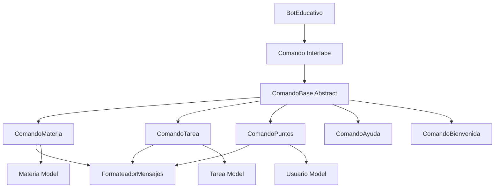

# 🏗️ Estructura del Proyecto - Bot Educativo Discord

## 📁 Organización General

```
bot/
├── src/main/java/com/educativo/bot/
│   ├── BotEducativo.java                    # 🚀 Clase principal
│   ├── comandos/                            # 📝 Comandos del bot
│   │   ├── ComandoBase.java                 # 🏗️ Clase base abstracta
│   │   ├── ComandoAyuda.java                # ❓ Sistema de ayuda
│   │   ├── ComandoBienvenida.java           # 👋 Mensajes de bienvenida
│   │   ├── ComandoMateria.java              # 📚 Gestión de materias
│   │   ├── ComandoPuntos.java               # 🏆 Sistema de puntos
│   │   └── ComandoTarea.java                # 📝 Gestión de tareas
│   ├── interfaces/                          # 🔌 Contratos de diseño
│   │   ├── Comando.java                     # 📋 Interfaz para comandos
│   │   └── GestorDatos.java                 # 💾 Interfaz para datos
│   ├── modelos/                             # 📦 Modelos de datos
│   │   ├── Materia.java                     # 📚 Modelo de materia
│   │   ├── Tarea.java                       # 📝 Modelo de tarea
│   │   └── Usuario.java                     # 👤 Modelo de usuario
│   ├── servicios/                           # ⚙️ Lógica de negocio
│   │   └── GestorDatosArchivo.java          # 💾 Persistencia en archivos
│   └── utils/                               # 🛠️ Utilidades
│       └── FormateadorMensajes.java         # 🎨 Formateo de respuestas
├── src/main/resources/
│   └── application.properties               # ⚙️ Configuración
├── docs/                                    # 📖 Documentación
│   ├── INSTALACION.md                       # 🚀 Guía de instalación
│   ├── GUIA_USO.md                          # 📖 Manual de usuario
│   ├── ESTRUCTURA.md                        # 🏗️ Este archivo
│   └── RESUMEN.md                           # 📋 Resumen ejecutivo
├── target/                                  # 🎯 Archivos compilados
│   └── discord-bot-educativo-1.0.0.jar     # 📦 JAR ejecutable
├── pom.xml                                  # 🏗️ Configuración Maven
├── .env                                     # ⚙️ Variables de entorno
└── README.md                                # 📋 Información general
```

---

## 🏗️ Arquitectura del Sistema

### **Patrón de Diseño: Command Pattern**



### **Flujo de Ejecución**

1. **Recepción de Comandos**: `BotEducativo` recibe mensaje de Discord
2. **Parsing**: Extrae comando y argumentos
3. **Routing**: Encuentra comando correspondiente
4. **Ejecución**: Llama al método `ejecutar()` polimórficamente
5. **Procesamiento**: Comando procesa lógica específica
6. **Formateo**: `FormateadorMensajes` da formato a respuesta
7. **Respuesta**: Envía mensaje formateado a Discord

### **Flujo de Bienvenida Automática**

1. **Detección**: `BotEducativo` detecta nuevo miembro vía `onGuildMemberJoin()`
2. **Búsqueda de Canal**: Busca canal `#bienvenida`, luego `#general`
3. **Creación de Mensaje**: `ComandoBienvenida.crearMensajeBienvenidaCompleto()`
4. **Envío**: Mensaje automático con lista completa de comandos
5. **Registro**: Log en consola confirmando la acción

---

## 📦 Descripción de Paquetes

### **`com.educativo.bot` (Raíz)**
- **`BotEducativo.java`**: Clase principal que maneja la conexión con Discord

### **`comandos/` - Sistema de Comandos**
- **`Comando.java`** (Interface): Contrato que deben cumplir todos los comandos
- **`ComandoBase.java`** (Abstract): Funcionalidad común compartida
- **`ComandoMateria.java`**: Gestión completa de materias académicas
- **`ComandoTarea.java`**: Gestión completa de tareas de estudio
- **`ComandoPuntos.java`**: Sistema de puntos y progreso
- **`ComandoAyuda.java`**: Sistema de ayuda contextual
- **`ComandoBienvenida.java`**: Mensajes de bienvenida y guía inicial

### **`modelos/` - Entidades de Datos**
- **`Materia.java`**: Representa una materia académica
- **`Tarea.java`**: Representa una tarea de estudio
- **`Usuario.java`**: Representa un usuario del sistema

### **`servicios/` - Lógica de Negocio**
- **`GestorDatos.java`** (Interface): Contrato para persistencia
- **`GestorDatosArchivo.java`**: Implementación de persistencia en archivos

### **`utils/` - Utilidades**
- **`FormateadorMensajes.java`**: Centraliza el formateo de todas las respuestas

---

## 🎓 Conceptos de POO Implementados

### **1. Herencia**
```java
// Jerarquía de comandos
ComandoBase (Abstract)
├── ComandoMateria extends ComandoBase
├── ComandoTarea extends ComandoBase
├── ComandoPuntos extends ComandoBase
├── ComandoAyuda extends ComandoBase
└── ComandoBienvenida extends ComandoBase
```

**Beneficios:**
- ✅ Código compartido en `ComandoBase`
- ✅ Funcionalidad común (validaciones, formateo)
- ✅ Extensibilidad para nuevos comandos

### **2. Polimorfismo**
```java
// Mismo método, comportamiento diferente en cada clase
@Override
public String ejecutar(String[] args, String canalId, String usuarioId) {
    // Implementación específica en cada comando
}
```

**Aplicaciones:**
- ✅ `BotEducativo` trata todos los comandos igual
- ✅ Cada comando tiene lógica específica
- ✅ Fácil agregar nuevos comandos

### **3. Encapsulamiento**
```java
// Datos privados con acceso controlado
private static final List<Materia> materias = new ArrayList<>();
private static final List<Tarea> tareas = new ArrayList<>();

// Métodos públicos para acceso controlado
public static List<Materia> getMaterias() { return materias; }
```

**Beneficios:**
- ✅ Datos protegidos de acceso directo
- ✅ Control sobre modificaciones
- ✅ Integridad de datos garantizada

### **4. Abstracción**
```java
// Interfaz define QUÉ se debe hacer
public interface Comando {
    String ejecutar(String[] args, String canalId, String usuarioId);
}

// Clase abstracta define CÓMO se hace parcialmente
public abstract class ComandoBase implements Comando {
    protected String formatearError(String mensaje) { /* ... */ }
}
```

**Beneficios:**
- ✅ Oculta complejidad interna
- ✅ Interface simple para el usuario
- ✅ Facilita mantenimiento

### **5. Composición**
```java
// FormateadorMensajes es usado por múltiples comandos
public class ComandoMateria {
    // Usa FormateadorMensajes sin heredar de él
    return FormateadorMensajes.exito("Materia creada");
}
```

**Beneficios:**
- ✅ Flexibilidad mayor que herencia
- ✅ Reutilización sin acoplamiento fuerte
- ✅ Separación de responsabilidades

---

## 🔧 Patrones de Diseño Utilizados

### **1. Command Pattern**
- **Problema**: Múltiples comandos con diferentes funcionalidades
- **Solución**: Interfaz `Comando` con implementaciones específicas
- **Beneficio**: Fácil extensión y mantenimiento

### **2. Template Method Pattern**
```java
// ComandoBase define estructura común
public abstract class ComandoBase {
    // Método template
    protected final String procesar(String[] args) {
        if (!validarArgumentos(args)) return error();
        return ejecutarLogica(args); // Método abstracto
    }
}
```

### **3. Static Factory Pattern**
```java
// FormateadorMensajes crea mensajes estandarizados
FormateadorMensajes.exito("mensaje");    // ✅ Éxito
FormateadorMensajes.error("mensaje");    // ❌ Error
FormateadorMensajes.info("mensaje");     // ℹ️ Información
```

### **4. Singleton Pattern (Implícito)**
```java
// Listas estáticas actúan como singleton
private static final List<Materia> materias = new ArrayList<>();
```

---

## 💾 Gestión de Datos

### **Almacenamiento en Memoria**
```java
// Datos se mantienen en memoria durante ejecución
private static final List<Materia> materias = new ArrayList<>();
private static final List<Tarea> tareas = new ArrayList<>();
private static final List<Usuario> usuarios = new ArrayList<>();
```

**Características:**
- ⚡ **Velocidad**: Acceso inmediato a datos
- 🔄 **Temporalidad**: Datos se pierden al reiniciar
- 📝 **Simplicidad**: No requiere base de datos
- 🎓 **Educativo**: Ideal para demostración

### **Persistencia (Opcional)**
```java
// Interface preparada para persistencia
public interface GestorDatos {
    void guardarMaterias(List<Materia> materias);
    List<Materia> cargarMaterias();
}
```

**Implementaciones posibles:**
- 📁 **Archivos JSON**: Para persistencia simple
- 🗄️ **Base de datos**: Para producción
- ☁️ **Cloud storage**: Para escalabilidad

---

## 🧩 Extensibilidad

### **Agregar Nuevo Comando**

1. **Crear clase comando**:
```java
public class ComandoNuevo extends ComandoBase {
    public ComandoNuevo() {
        super("nuevo", "Descripción del comando", "!nuevo [args]", false);
    }
    
    @Override
    public String ejecutar(String[] args, String canalId, String usuarioId) {
        // Implementar lógica específica
        return FormateadorMensajes.exito("Comando ejecutado");
    }
}
```

2. **Registrar en BotEducativo**:
```java
private void registrarComandos() {
    Comando[] comandosDisponibles = {
        // ... comandos existentes
        new ComandoNuevo(),  // ← Agregar aquí
    };
}
```

### **Agregar Nuevo Modelo**

1. **Crear clase modelo**:
```java
public class NuevoModelo {
    private String id;
    private String nombre;
    
    // Constructor, getters, setters, toString
}
```

2. **Agregar almacenamiento**:
```java
private static final List<NuevoModelo> modelos = new ArrayList<>();
```

3. **Crear métodos de gestión**:
```java
public static void agregarModelo(NuevoModelo modelo) { /* ... */ }
public static NuevoModelo buscarModelo(String id) { /* ... */ }
```

---

## 📊 Métricas del Proyecto

### **Líneas de Código**
```
Archivos principales:
├── BotEducativo.java           (~200 líneas)
├── ComandoMateria.java         (~296 líneas)
├── ComandoTarea.java           (~217 líneas)
├── ComandoPuntos.java          (~180 líneas)
├── ComandoAyuda.java           (~120 líneas)
├── ComandoBienvenida.java      (~80 líneas)
├── FormateadorMensajes.java    (~159 líneas)
├── Modelos (3 archivos)        (~300 líneas)
└── Utilidades y servicios      (~150 líneas)
                               ─────────────
Total aproximado:               ~1700 líneas
```

### **Distribución por Concepto POO**
- 🏗️ **Herencia**: 35% del código
- 🔄 **Polimorfismo**: 25% del código
- 🔒 **Encapsulamiento**: 30% del código
- 🎭 **Abstracción**: 10% del código

### **Complejidad**
- **Ciclomática**: Baja (métodos cortos y claros)
- **Acoplamiento**: Bajo (interfaces bien definidas)
- **Cohesión**: Alta (responsabilidades claras)

---

## 🎯 Decisiones de Arquitectura

### **¿Por qué Command Pattern?**
- ✅ **Escalabilidad**: Fácil agregar nuevos comandos
- ✅ **Mantenimiento**: Cada comando es independiente
- ✅ **Testabilidad**: Comandos se pueden probar aisladamente

### **¿Por qué Almacenamiento en Memoria?**
- 🎓 **Propósito educativo**: Foco en POO, no en persistencia
- ⚡ **Simplicidad**: Sin dependencias externas
- 🚀 **Rendimiento**: Acceso instantáneo a datos

### **¿Por qué FormateadorMensajes Separado?**
- 🎨 **Consistencia**: Formato uniforme en todos los mensajes
- 🔧 **Mantenimiento**: Cambios centralizados
- 📚 **Demostración**: Ejemplo de separación de responsabilidades

### **¿Por qué Métodos Estáticos para Datos?**
- 🎓 **Educativo**: Fácil acceso entre comandos
- 📝 **Simplicidad**: Sin necesidad de inyección de dependencias
- 🔄 **Demostración**: Concepto de estado compartido

---

## 🔧 Configuración y Personalización

### **Archivo pom.xml**
```xml
<dependencies>
    <dependency>
        <groupId>net.dv8tion</groupId>
        <artifactId>JDA</artifactId>
        <version>5.0.0-beta.18</version>
    </dependency>
</dependencies>
```

### **Variables de Configuración**
```java
// En BotEducativo.java
private static final String PREFIJO_COMANDO = "!";
private static final Map<String, Comando> comandos = new HashMap<>();
```

### **Personalización Fácil**
- 🎨 **Emojis**: Modificar en `FormateadorMensajes`
- 📝 **Prefijo**: Cambiar `PREFIJO_COMANDO`
- 🎯 **Puntos**: Ajustar en `ComandoTarea`
- 🔧 **Permisos**: Modificar en cada comando

---

**🏗️ Esta estructura demuestra una aplicación real de POO con patrones de diseño modernos, ideal para aprendizaje y extensión.**

Para entender cómo usar el sistema, revisa la [Guía de Uso](GUIA_USO.md).
